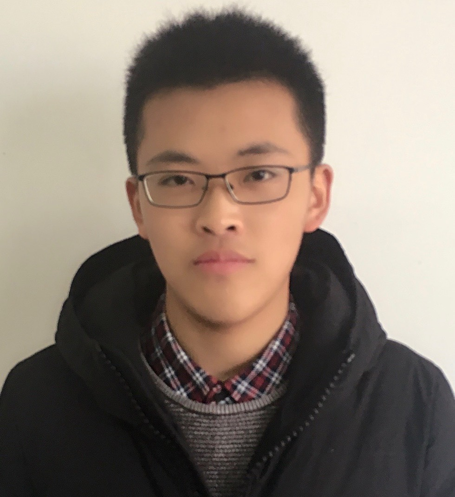

[Beihang University](https://www.buaa.edu.cn), China.

## About Me

I am currently a second year master student in pattern recognition and intelligent system at [Beihang University](https://www.buaa.edu.cn). My mentor is Prof. Baochang Zhang. My research interests are in machine learning and computer vision, especially in neural architecture search (NAS), model quantization and pruning, unsupervised learning and adversarial deep learning.

## Journal & Conference Papers

- **Hanlin Chen**, Li'an Zhuo, Baochang Zhang, Xiawu Zheng, Jianzhuang Liu, David Doermann, Rongrong Ji. [Binarized Neural Architecture Search](https://arxiv.org/pdf/1911.10862v1.pdf). AAAI, 2020. [CODES](https://github.com/HLinChen/BNAS)

- Li'an Zhuo, Baochang Zhang, Linlin Yang, **Hanlin Chen**, Qixiang Ye, David Doermann, Rongrong Ji, Guodong Guo. Cogradient Descent for Bilinear Optimization. CVPR, 2020.

- Sheng Xu, **Hanlin Chen**, et al. [Efficient Block Pruning based on kernel and feature stablization](https://ieeexplore.ieee.org/document/8946001). Digital Image Computing: Techniques and Applications, 2019. (DICTA 2019)

- Chunlei Liu, Wenrui Ding, Yu Hu, **Hanlin Chen**, Baochang Zhang, Shuo Liu. [Guided Convolutional Network](https://www.researchgate.net/publication/336051683_Guided_Convolutional_Network). 13th International Conference on Distributed Smart Cameras. (ICDSC 2019)

  
- **Hanlin Chen**, Baochang Zhang, Song Xue, Xuan Gong, Hong Liu, Rongrong Ji, David Doermann. Anti-Bandit Neural Architecture Search for Model Defense, on submission to ECCV 2020.

- **Hanlin Chen**, Li'an Zhuo, Baochang Zhang, Xiawu Zheng, Jianzhuang Liu, Rongrong Ji, David Doermann, Guodong Guo. Binarized Neural Architecture Search for Efficient Object Recognition, on submission to IJCV.

- **Hanlin Chen**, Xudong Zhang, et al. Efficient Facial Landmark Localization based on Binarized Neural Networks, on submission to Transactions on Intelligent Systems and Technology. (TIST)

- Li'an Zhuo, **Hanlin Chen**, Linlin Yang, Yanjun Zhu, Chen Chen, Baochang Zhang, David Doermann. CP-NAS: Child-Parent Neural Achitecture Search for 1-bit CNNs, on submission to IJCAI 2020.

- Xuan Gong, **Hanlin Chen**, Sheng Xu, Baochang Zhang, Jialian Wu, David Doermann. Bandit Network Architecture Search, on submission to IJCAI 2020.

- Sheng Xu, **Hanlin Chen**, Xuan Gong, Baochang Zhang, David Doermann. Binarized Backbone Search for Real-Time Object Detection , on submission to IJCAI 2020.

## Education

* **Beihang University, Beijing, China**

    Master of Pattern Recognition and Intelligent System, Sep 2018 - Present

* **Shenyang Aerospace University, Shenyang, China**

    Bachelor of Aircraft Design and Engineering, Sep 2012 - Jun 2018

## Awards

* **Liaoning Provincial Government Scholarship, 2016.**

## Contact

**Institution**: School of Automation Science and Electrical Engineering, Beihang University, China

**Address**: Room 1126, New Main Building #E, XueYuan Road No.37, Beihang University, 100191

**E-mail**:  [hlchen@buaa.edu.cn](mailto:hlchen@buaa.edu.cn) or [hlchen1105@gmai.com](mailto:hlchen1105@gmai.com)

**Phone**: [+86-17812032728](tel:+86-17812032728)

---

